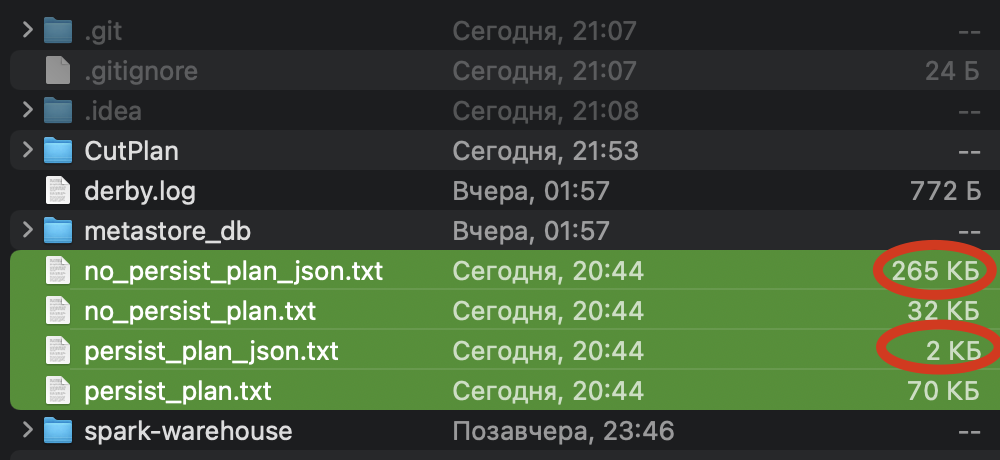

<h2>Problem</h2>

Problem found for Spark version: <b>3.0.1</b> <br>
Scala version: <b>2.12</b>

I am working with spark version 3.0.1. I am generating a large dataframe. 
At the end  calculations, I save dataframe plan in json format. I need him. <br>
But there is one problem. If I persist a DataFrame, then its plan in json format is completely truncated. 
That is, all data lineage disappears.

For example, I do this:
```Scala
val myDf: DataFrame = ???
val myPersistDf = myDf.persist
  //toJSON method cuts down my plan
val jsonPlan = myPersistDf.queryExecution.optimizedPlan.toJSON
```
As a result, only information about the current columns remains.<br>
If you use the spark version 3.1.2, then there is no such problem. That is, the plan is not cut.

<h2>How to use</h2>

1. Build project in IDE
2. Open _**CutPlan.scala**_ in directory _**/src/main/scala/**_
3. Change the value of the _isNeedPersist_ variable to _false_. And run project.
```Scala
17: val isNeedPersist = false
```
4. Change the value of the _isNeedPersist_ variable to _true_. And run project.
```Scala
17: val isNeedPersist = true
```
5. Four plan files will appear in the root directory. Now you can see the problem.


UPD(1):

Now I'm trying to convert each node to json separately. Now it doesn't work perfectly, but I think we need to go in this direction.
The thing is, I'm losing some data lineage.

```Scala
val jsonPlan = s"[${getJson(result_df.queryExecution.optimizedPlan).mkString(",")}]"

  def getJson(lp: TreeNode[_]): Seq[String] = {
    val children = (lp.innerChildren ++ lp.children.map(c => c.asInstanceOf[TreeNode[_]])).distinct
    JsonMethods.compact(JsonMethods.render(JsonMethods.parse(lp.toJSON)(0))) +:
      getJson(t.asInstanceOf[TreeNode[_]])))
      children.flatMap(t => getJson(t))
  }
  ```

P.S. Issue in Jira: https://issues.apache.org/jira/browse/SPARK-38068
     Question in stackoverflow: https://stackoverflow.com/questions/70910318/why-do-the-persist-and-cache-methods-shorten-dataframe-plan-in-spark
